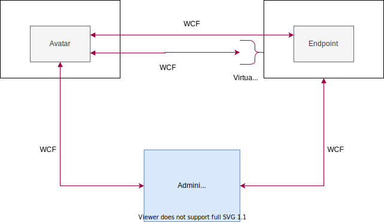

# Introducing gRPC

ProconTEL has a large code base which at it's center lays communication. Unfortunatly, it is also tightly coupled with existing communication layer, which is WCF (for those lucky ones, WCF stands for [_Windows Communication Foundation_](https://docs.microsoft.com/en-us/dotnet/framework/wcf/whats-wcf)). In order to add another communication protocol and replace it, in the long term, we needed to refactor and decouple _ProconTEL Message Broker_ from communication layer. Probably this phase can be described in another article, but here we will focus only on communication layer.

More information about gRPC you can [learn here](https://grpc.io/docs/what-is-grpc/introduction/).

## How did it work in past?

Below diagram shows communication layer architecture from before our changes.

## Introducing the "switch"

In the next diagram you can see communication layer architecture after we introduced the switch, which enables gRPC or WCF.

## Next steps

As you can see, the "switch" is just a small part on the way of replacing completly WCF. Even when gRPC communication mode is on, only content exchanged between channels and pools (via avatars) is send over gRPC protocol. And yet, this it is still not complete, as infrastructure calls are made via WCF. That's why in next steps we will be working on replacing another part of WCF communication layer, so let's stay in touch.