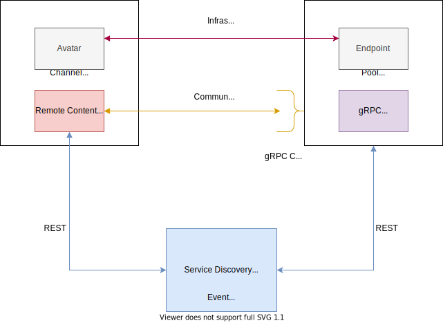
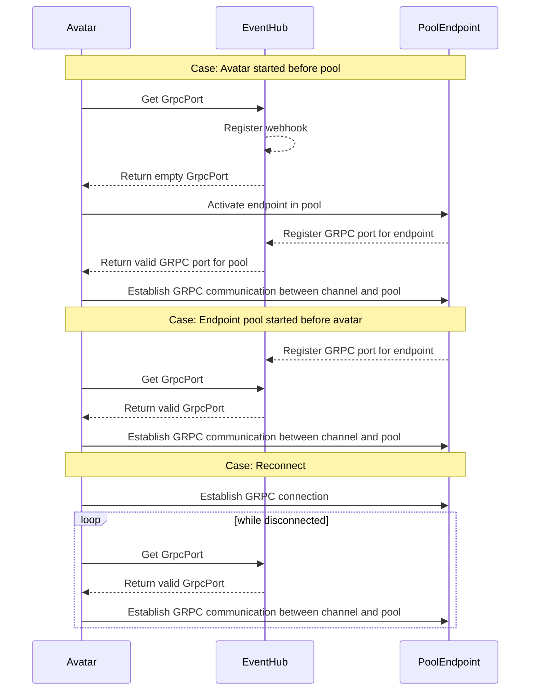

# Introducing gRPC - part 2

When compared version v3.0.26 with previous one from functional point of view there's no big difference. One may even say there is none. However, we managed to change quiet a lot under the hood. Let's start from beginning.

## _Service Discovery_ and notifications 

In the next diagram you can see communication layer architecture which uses gRPC for exchanging content between channel and pool.

As this looks quite simple on the diagram, things get complicated when you first start channel and would expect to receive notification when endpoint in pool is available. This the place where this story actually begins.

Each ProconTEL channel exposes a REST interface to receive a webhook notification about endpoint available in running pool. When it happens, a gRPC connection is established and content can be exchanged via duplex channel. What this implies is that whenever user starts an _avatar_, channel sends a request to _Service Discovery_ (part of _Event Hub_) to get information about location of endpoint and if it's not available, registers a webhook for notification.

From pool perspective it looks slightly simpler. When endpoint in pool activates, a request to _Service Discovery_ is send and that's all.

The third actor, _Service Discovery_, is responsible for collecting information about available endpoints in pools and notifying channels.  _Service Discovery_ exposes only REST interfaces.

For a better understanding of described process have a look at the diagrams below.

