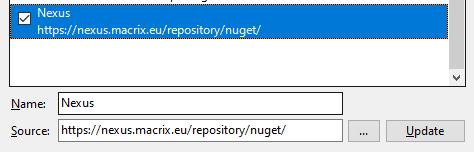
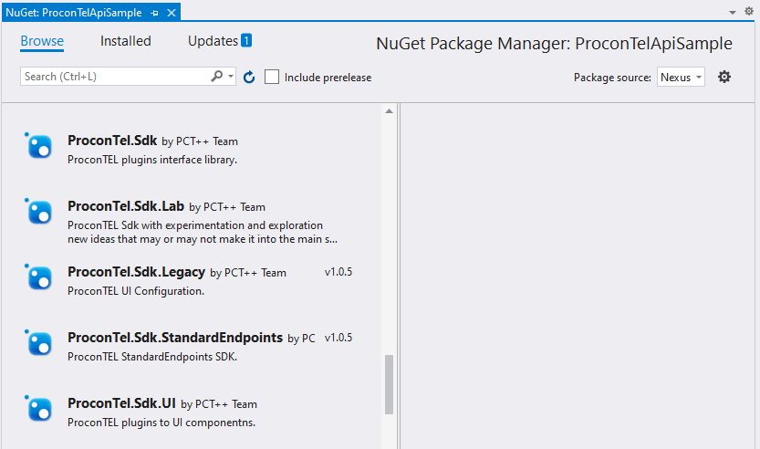

# Using ProconTEL nuget packages

Each ProconTEL release is published with set of nuget packages which contains both old and new SDK definitions, but also some extensions/modules are also available.

## How to use it?

Make sure you have set up the Nexus repository as one of packages sources in your Visual Studio.
Go to `Tools` -> `Options` -> `NuGet Package Manager` -> `Package Sources`, click on the _plus_ button, fill name and source with `https://nexus.macrix.eu/repository/nuget/` and click _Update_ button.

When this is configured you can browse for available nuget packages and install/update packages directly from Visual Studio.

